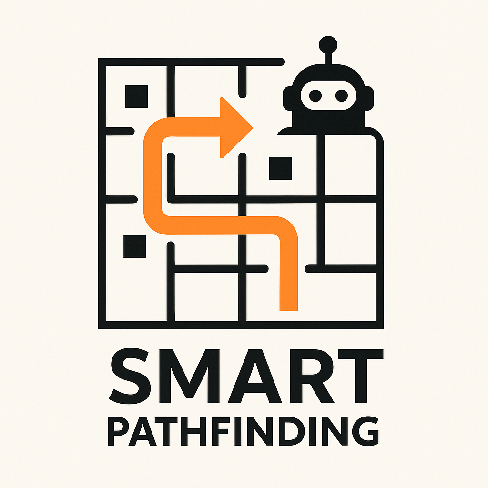
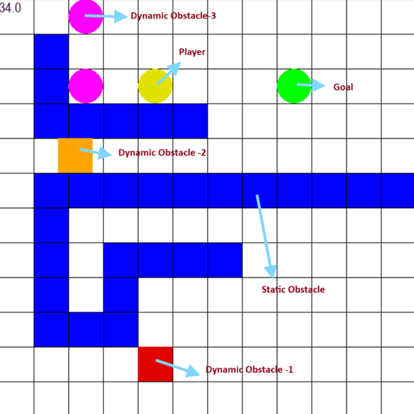

<div id="top"></div>

<!-- PROJECT SHIELDS -->
<!-- https://www.markdownguide.org/basic-syntax/#reference-style-links-->
<div align="center">

[![Contributors][contributors-shield]][contributors-url]
[![Forks][forks-shield]][forks-url]
[![Stargazers][stars-shield]][stars-url]
[![Issues][issues-shield]][issues-url]
[![MIT License][license-shield]][license-url]

</div>

<!-- PROJECT LOGO -->
<br />
<!-- UPDATE -->
<div align="center">
  <a href="https://github.com/cgs-iitkgp/PathfindingSystem">
     
  </a>

  <h3 align="center">PathfindingSystem</h3>

  <p align="center">
  <!-- UPDATE -->
    <i>Smart Pathfinding in Dynamic Worlds: Navigating Safely, Efficiently, Intelligently</i>
  </p>
</div>


<!-- TABLE OF CONTENTS -->
<details>
<summary>Table of Contents</summary>

- [About The Project](#about-the-project)
- [Getting Started](#getting-started)
  - [Prerequisites](#prerequisites)
  - [Installation](#installation)
- [Usage](#usage)
- [Contact](#contact)
  - [Maintainer(s)](#maintainers)
  - [creators(s)](#creators)
- [Additional documentation](#additional-documentation)

</details>


<!-- ABOUT THE PROJECT -->
## About The Project
<!-- UPDATE -->
<div align="center">
  <a href="https://github.com/cgs-iitkgp/PathfindingSystem">
    
  </a>
</div>

This repository contains a grid-based pathfinding system created from scratch that finds the path to reach a goal on the grid while avoiding both static and dynamic obstacles in the shortest time by using A* algorithm.
It uses Python and Pygame for simulation.

### Features

- User-Configurable Environment
- A customizable 2D grid map where each cell represents either a free space or a static or dynamic obstacle.
- Any cell even partially occupied by a dynamic obstacle is not considered free(player cannot move through it)
- The player can either move left, right, up or down in some time or wait at the same cell for a small amount of time if required.
- A GUI system using pygame by which user can position player, goal and all obstacles and input their movement patterns.
- Three types of dynamic obstacles:
  - **Dynamic Obstacle -1**: Dynamic obstacles whose appearance,disappearance and movement pattern is already known before starting grid traversal to adjust movement accordingly.
  - **Dynamic Obstacle -2**: Obstacles which are added during visualization. They can be added, deleted or their velocity can be changed by pausing the grid traversal.
  - **Dynamic Obstacle -3**: Enemies which chase the player. Can be added at start. Can be both added and deleted by pausing the traversal. Cannot pass through other types of obstacles, move at the same speed as the player.


<p align="right">(<a href="#top">back to top</a>)</p>

## Getting Started

To set up a local instance of the application, follow the steps below.

### Prerequisites
The following dependencies are required to be installed for the project to function properly:
<!-- UPDATE -->
* npm
  ```sh
  npm install npm@latest -g
  ```

<p align="right">(<a href="#top">back to top</a>)</p>

### Installation

_Now that the environment has been set up and configured to properly compile and run the project, the next step is to install and configure the project locally on your system._
<!-- UPDATE -->
1. Clone the repository
   ```sh
   git clone https://github.com/cgs-iitkgp/PathfindingSystem.git
   ```
2. Make the script executable
   ```sh
   cd ./PathfindingSystem
   chmod +x ./PathfindingSystem
   ```
3. Execute the script
   ```sh
   ./PathfindingSystem
   ```

<p align="right">(<a href="#top">back to top</a>)</p>


<!-- USAGE EXAMPLES -->
## Usage
<!-- UPDATE -->

<div align="center">
  <a href="https://github.com/cgs-iitkgp/PathfindingSystem">
    
  </a>
</div>

- **Input Initials**: After running the file, enter the grid width and height and maximum time to reach the goal, assuming the player takes 1 unit time to move 1 block.
- **Make Map**: Then a grid opens up in a pygame window. Then the first two cells clicked will be player and goal initial positions. The cells clicked after that will be static obstacles. Press 'Enter' after finalizing them. 
- **Add Dynamic Obstacles-3**: Then the cells clicked will create Dynamic Obstacle-3 at those positions. Press 'Enter' after finalizing them.
- **Add Dynamic Obstacles-1**: Press ‘o’ to create a new obstacle. Then use arrow keys to change time at the top left corner of the window. Press ‘a’ and click a cell to make the obstacle appear at that time on that cell. Press ‘d’ to make it disappear at that time. Press ‘m’ to start moving the obstacle at that time. After pressing ‘m’, Click any cell(initial cell), then increase the time and click another cell(final cell). This will make the obstacle move from its current position at that time in direction of final cell from initial cell upto same distance as the distance between those two cells during that time interval. Then press 'Enter' to start Visualization.
- **Pausing**: During Visualization you can press ‘p’ to pause the traversal. You can modify Dynamic Obstacles-2 and Dynamic Obstacles-3 while you are in pause mode.
  - **Dynamic Obstacles-2**: Now if you press ‘a’ and then click a cell, it will create a new obstacle at that cell with zero velocity. Pressing ‘m’ and ‘n’ can change the selected obstacle(marked with cyan colour). Velocity of the selected obstacle can be changed using arrow keys. Pressing ‘d’ deletes the selected obstacle. Press ‘p’ again to enter next mode.
  - **Dynamic Obstacles-3**: Now if you press ‘a’ and then click a cell, it will create a new enemy at that cell. Pressing ‘m’ and ‘n’ can change the selected enemy(marked with cyan colour). Pressing ‘d’ deletes the selected enemy. Press ‘p’ again to resume the visualization with the modifications made.
- **Special Situations**: If the player finds no path to goal or an enemy finds no path to the player, it will stay at the same position till the end unless some modifications are made by pausing. If an enemy touches or will touch other type of obstacle, the enemy gets destroyed. 

<p align="right">(<a href="#top">back to top</a>)</p>

## Contact

### Maintainer(s)

The currently active maintainer(s) of this project.

<!-- UPDATE -->
- [Palaksh Goyal](https://github.com/Palaksh100)

### Creator(s)

Honoring the original creator(s) and ideator(s) of this project.

<!-- UPDATE -->
- [Palaksh Goyal](https://github.com/Palaksh100)

<p align="right">(<a href="#top">back to top</a>)</p>

## Additional documentation

  - [License](/LICENSE)
  - [Code of Conduct](/.github/CODE_OF_CONDUCT.md)
  - [Security Policy](/.github/SECURITY.md)
  - [Contribution Guidelines](/.github/CONTRIBUTING.md)

<p align="right">(<a href="#top">back to top</a>)</p>

<!-- MARKDOWN LINKS & IMAGES -->

[contributors-shield]: https://img.shields.io/github/contributors/cgs-iitkgp/PathfindingSystem.svg?style=for-the-badge
[contributors-url]: https://github.com/cgs-iitkgp/PathfindingSystem/graphs/contributors
[forks-shield]: https://img.shields.io/github/forks/cgs-iitkgp/PathfindingSystem.svg?style=for-the-badge
[forks-url]: https://github.com/cgs-iitkgp/PathfindingSystem/network/members
[stars-shield]: https://img.shields.io/github/stars/cgs-iitkgp/PathfindingSystem.svg?style=for-the-badge
[stars-url]: https://github.com/cgs-iitkgp/PathfindingSystem/stargazers
[issues-shield]: https://img.shields.io/github/issues/cgs-iitkgp/PathfindingSystem.svg?style=for-the-badge
[issues-url]: https://github.com/cgs-iitkgp/PathfindingSystem/issues
[license-shield]: https://img.shields.io/github/license/cgs-iitkgp/PathfindingSystem.svg?style=for-the-badge
[license-url]: https://github.com/cgs-iitkgp/PathfindingSystem/blob/master/LICENSE